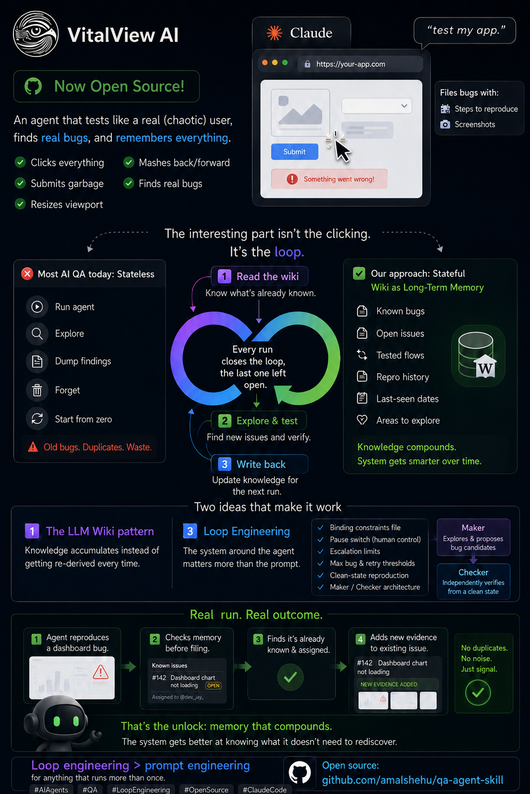

# qa-agent-skill

Turn Claude into an autonomous QA tester for your web app. Say "test my app" and Claude opens it in a browser, explores it like a confused/adversarial user — clicks everything, submits garbage into forms, resizes the viewport, mashes back/forward, tries invalid routes — and files real bugs it finds as GitHub issues or Jira tickets, each with a repro (numbered screenshots, assembled into a GIF) and a clear write-up.



The interesting part isn't the clicking — most "AI QA" runs are stateless: spin up, click around, dump findings, forget everything, and half of next run's "new" bugs are just old ones nobody remembered filing. This skill is built around two ideas that fix that: a **wiki as compounding memory** and a few **loop-engineering guardrails** that make it safe to let the exploration run on its own. Both are explained below.

## What it does

1. **Setup interview** — asks for the target URL (local dev server or deployed), the environment (staging/test vs. production — production is read-only), and which tracker to use (Jira and/or GitHub).
2. **Reads the QA wiki, then Jira** — checks what's already known (open bugs, tested flows, last-seen dates) before doing anything else. If a Jira MCP is connected, fetches open QA tickets and asks which one to start with; no ticket or no Jira, it explores freely.
3. **Exploration** — a subagent drives the app with Claude's browser tools, clicking every interactive element, submitting edge-case input (empty, oversized, wrong type, special characters, unicode), resizing across breakpoints, and mashing browser history — while watching the console and network tab for real failures. Anything that looks broken is a **candidate**, not a confirmed bug yet.
4. **Independent verification** — a maker/checker split: the exploring subagent is mid-exploration and prone to false positives (leftover form state, race conditions), so the main conversation re-attempts each candidate's minimal repro from a genuinely fresh page load before it counts as real. Doesn't reproduce cleanly → not filed, not written to the wiki.
5. **Evidence** — for each confirmed bug, captures a numbered screenshot at each repro step and assembles them into a GIF (via `ffmpeg`) so every bug report comes with a visual repro, not just prose.
6. **Reports** — every filed bug follows a fixed standard: specific title, minimal numbered repro, expected vs. actual, environment, justified severity, and evidence. Written the way a teammate would flag it, not "I have identified the following issue." Deduped against the wiki and existing tickets first — a match gets a comment, not a new ticket.
7. **Confirms before filing** — shows you the draft (destination + title + body) and waits for a yes before creating anything, since filing is visible to your whole team.

It deliberately distinguishes real bugs (crashes, console exceptions, broken layouts, silent data loss, validation bypass) from expected behavior (a form correctly rejecting bad input is not a bug).

## Why this works: loop engineering, not prompt engineering

> "I don't prompt Claude anymore. I have loops running that prompt Claude and figuring out what to do." — the shift this skill is built around: the leverage isn't a cleverer prompt, it's the system that runs the agent, run after run.

A single exploration run is one iteration of a loop, and this skill runs at **autonomy level L2 (assisted)**: exploration, verification, and wiki updates happen on their own, but anything visible outside the conversation — filing a ticket, posting a comment, `git commit` — is human-gated. What makes that safe to leave running is a set of guardrails borrowed from loop engineering, all enforced through `.qa-wiki/CONSTRAINTS.md` — a binding, project-editable rulebook read at the start of every run, not just a suggestion:

- **A pause switch** — a `PAUSED:` line stops the run immediately, no exploring, no filing.
- **Escalation limits, not infinite loops** — a known bug that won't reproduce after 2 fresh-load attempts gets marked `unverified` and handed to a human, instead of the agent guessing it's fixed or retrying forever. A run that turns up 15+ candidates stops and reports rather than cataloguing more — that volume usually means something systemic broke (bad deploy, wrong environment), worth a human look before more time goes into symptoms.
- **Maker/checker split** — the subagent that explores is the worst-positioned actor to also judge what's real (it's mid-exploration, prone to false positives from leftover state). An independent pass re-verifies before anything is written down as confirmed.
- **Human gates on anything irreversible or visible** — filing, committing, closing a ticket. Never assumed, always shown and confirmed first.

Same idea as build systems that gate merges on tests passing rather than trusting the last commit was fine — the constraints don't make the agent smarter, they make it safe to not watch it constantly.

## The QA wiki: an LLM Wiki, not RAG

Most agent-plus-docs setups are RAG: retrieve fragments at query time, synthesize from scratch, forget. That's fine for one-shot Q&A, but wrong for anything that runs more than once against the same app — a QA agent that forgets what it found yesterday will rediscover it today and might file it twice.

Instead, `.qa-wiki/` — living in the target project's own repo, git-committed, browsable directly as an Obsidian vault — is a compounding knowledge base, following the [LLM Wiki pattern](https://gist.github.com/karpathy/442a6bf555914893e9891c11519de94f): read once, integrated permanently, kept current, rather than re-derived every run.

```
.qa-wiki/
  CLAUDE.md              # the schema: conventions, page formats, workflow rules
  CONSTRAINTS.md         # binding rules read first every run (see above)
  index.md               # catalog: open bugs, unverified bugs, fixed bugs, flows tested
  log.md                 # append-only run history, plus process notes for next time
  bugs/<bug-slug>.md     # one page per distinct bug — status, repro, evidence, ticket link
  flows/<flow-slug>.md   # one page per user flow exercised, linking to bugs found there
  screenshots/<bug-slug>/NN-step.png   # the actual persisted evidence files
```

Before exploring anything, the skill reads `index.md` and the tail of `log.md` — what's open, what's fixed, what's been tested, when. After exploring, it writes back: bug pages updated in place (not duplicated), flows linked, `index.md` regenerated from the pages themselves. A bug marked `fixed` that reappears becomes a flagged **regression**, not a quiet re-file. This is what turned a real run into an agent that reproduced a genuine bug, checked the tracker, found it was already known and assigned, and added evidence to the existing ticket instead of creating duplicate noise — the actual unlock isn't smarter clicking, it's a memory that compounds so the system gets better at knowing what it doesn't need to rediscover.

## Health checks

`scripts/lint_qa_wiki.py` and `scripts/update_qa_wiki_index.py` (stdlib Python, no installs) keep `.qa-wiki/` from drifting as it grows — orphan bug pages, stale open bugs, broken links, and an `index.md` that's regenerated from the actual pages instead of hand-edited.

## Requirements

- [Claude Code](https://code.claude.com) with Claude's browser tools available
- `gh` CLI authenticated (`gh auth login`) if filing to GitHub issues
- A connected Jira MCP if filing to Jira (optional) — see [SETUP.md](SETUP.md) for the official Atlassian Rovo MCP server setup
- `ffmpeg` recommended for assembling repro GIFs — falls back to individual screenshots if not installed

## Installation

```bash
git clone https://github.com/amalshehu/qa-agent-skill.git ~/Code/qa-agent-skill
ln -s ~/Code/qa-agent-skill ~/.claude/skills/qa-agent-skill
```

Restart Claude Code (or start a new session) so it picks up the skill. Then just say:

```
test my app at https://staging.example.com
```

See [SETUP.md](SETUP.md) — GitHub issues need nothing beyond `gh auth login`; Jira is optional.

## Safety

`.qa-wiki/CONSTRAINTS.md` is the authoritative, project-editable version of this section once a wiki exists — see "Why this works" above. Defaults:

- Never triggers destructive/irreversible actions while exploring — a control that looks destructive is treated as the bug, not confirmed.
- Only tests against staging/test data unless you've explicitly said production is safe to hit.
- Never types real credentials or payment details — uses obviously fake test values.
- Bounded, not indefinite: escalation limits stop a stuck repro or a runaway bug count and hand it to a human instead of looping.

## Credits

- The QA wiki follows Andrej Karpathy's [LLM Wiki pattern](https://gist.github.com/karpathy/442a6bf555914893e9891c11519de94f).
- The constraints/escalation/autonomy-level guardrails are adapted from the [loop-engineering](https://github.com/cobusgreyling/loop-engineering) patterns collection.

## License

MIT — see [LICENSE](LICENSE).
